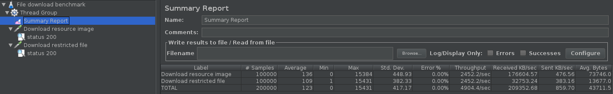
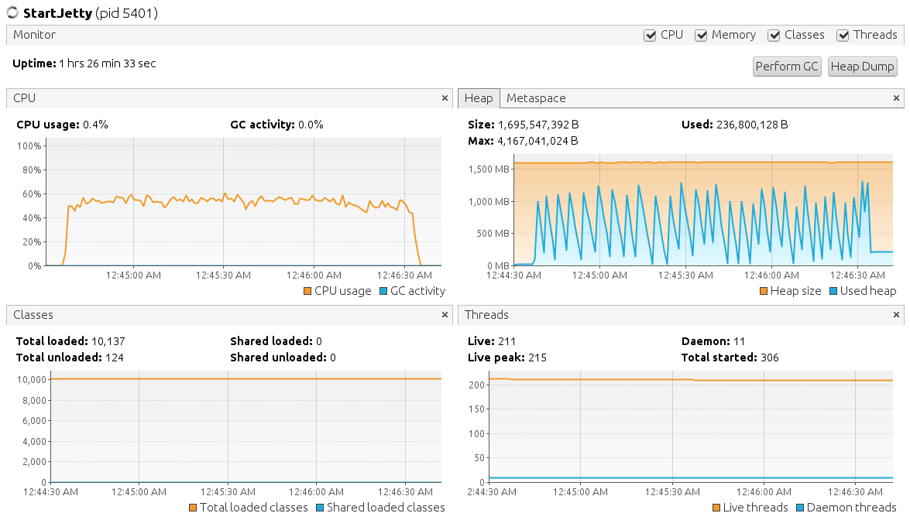
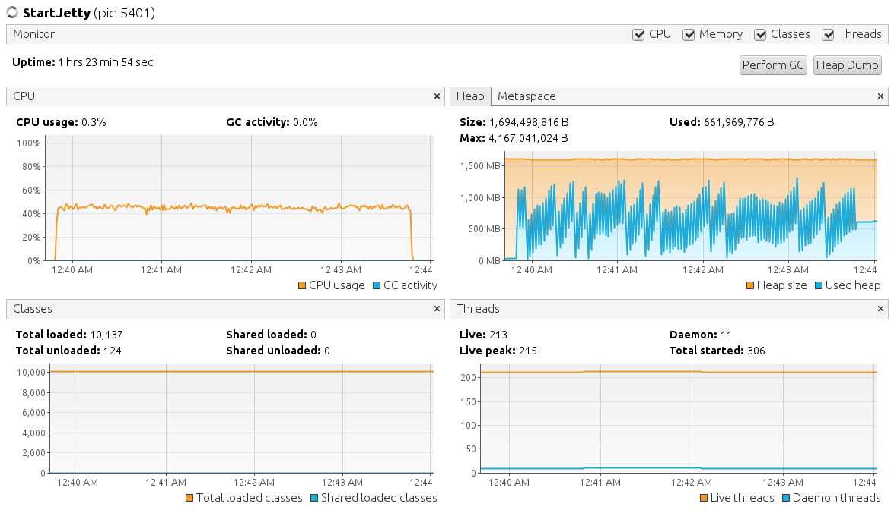

# Marketplace project description

## Cases

### Get list of all user's orders

We need to show all user's orders with bought products and download links for each product. I found several solutions:

- Get all user's orders, then for each order get order item. Obvious that it is not good solution because we have unpredictable number of database queries.

- Use OneToMany relationship. It looks better, but we can suggest that we don't know how many data will be pulled cascaded from DB (other tables depended on `order` may have OneToMany relationship).

- Get all order items with one query and work with them. But we will need to groupe them in some way.

The last solution was chosen. We get all order items then map them to orders. You can found that `OrderItem` have `@OneToMany` relationship to `download`, we admit that because `download` table have only one relationship (with `order_item`).

Final sql generated by `OrderItemDaoImp.find()` looks like this:

```sql
SELECT
  order_item.id,
  product.id,
  book.id,
  "order".id,
  download.id
  -- Other data from all tables
FROM
  order_item
  LEFT OUTER JOIN product ON order_item.product_id = product.id
  LEFT OUTER JOIN book ON product.id = book.id
  LEFT OUTER JOIN "order" ON order_item. "order_id" = "order".id
  LEFT OUTER JOIN download ON order_item.id = download.order_item_id
WHERE
  "order"."user_id" = 1;

```

Convert from `OrderItem` to `List<Order>`:

```java
	@Override public List<IOrder> getOrdersByUserId(final Integer userId) {
		final List<IOrderItem> orderItemList = orderItemService.getOderItemsByUserId(userId);

		final Set<IOrder> orderSet = new HashSet<>();
		orderItemList.forEach(orderItem ->
			orderSet.add(orderItem.getOrder().addOrderItem(orderItem))
		);

		final List<IOrder> orderList = new ArrayList<>(orderSet);
		orderList.sort((o2, o1) -> o1.getCreated().compareTo(o2.getCreated()));
		return orderList;
	}
```

We use `Set` to avoid to search proper **order** in list, on the other hand - we need to convert them to sorted list.

### Download benchmark

We have to methods of file serving. Usual static files are served directly by our servlet (I used Jetty for tests). Protected files are served by our app (we return InputStream for get request with access token parameter).



| Label                                 | # Samples | Average | Min  | Max  | Std. Dev. | Error % | Throughput | Avg. Bytes |
| ------------------------------------- | --------- | ------- | ---- | ---- | --------- | ------- | ---------- | ---------- |
| Thread Group:Download resource image  | 100000    | 199     | 0    | 7697 | 555.3     | 0.000%  | 1832.13939 | 11772      |
| Thread Group:Download restricted file | 100000    | 168     | 1    | 7725 | 449.92    | 0.000%  | 1836.71595 | 13677      |
| TOTAL                                 | 200000    | 184     | 0    | 7725 | 505.61    | 0.000%  | 3664.21164 | 12724.5    |

#### server static file directly by Jetty

#### server static file by our app with token access



As we can see we have similar resource usage, and if we will keep in mind that we make query to database to access restricted file we can claim that there is no difference between these serve methods.