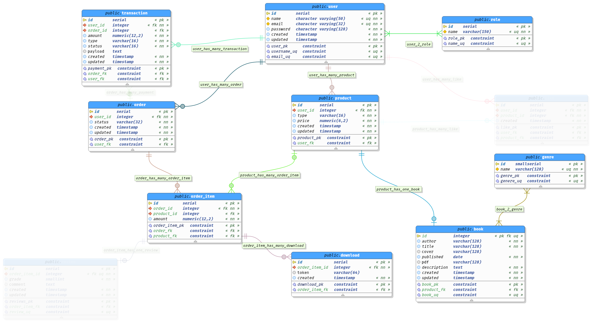
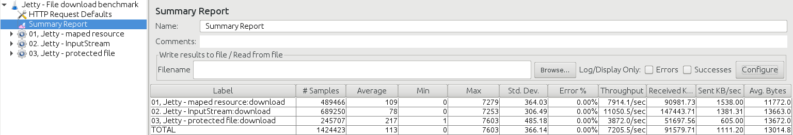
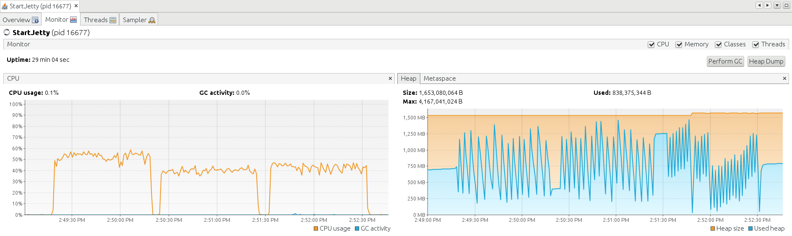
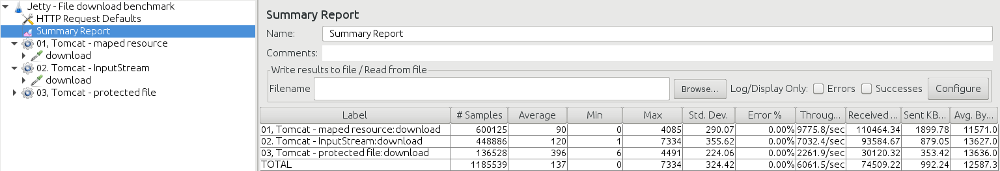
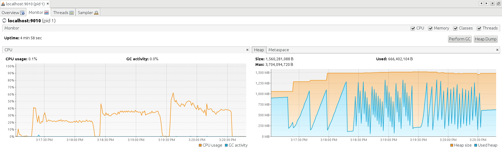

<style>
p {
	
}
.col-4{
	width: 33.3%;
}
.col-6{
	width: 50%;
}
.col-8{
	width: 66.6%;
}
</style>

# Marketplace for self-publishers

(study project)

- github.com/elegantsignal/marketplace
- marketplace.elegantsignal.com

  > contact with me if you want to see the project alive

Example users:

- `asimov@example.com` - `u2PX`
- `rand@example.com` - `u2PX`
- `taleb@example.com` - `u2PX`

---

# Own Goals

- use all types of relationships in database
- make complex database queries
- file upload and serving
- hibernate search
- YAML/JSON serialization and deserialization
- JSON API
- something new in infrastructure (caddy proxy server)

---

# Infrastructure

- [caddy](https://caddyserver.com/) + tomcat + spring + postgresql

- docker + docker-compose

- ansible pipline

Docker images are builded on the server.
I have two reasons for that — I have slow internet and long build process by CI-server.<br>**Don't do that** on real project.

> [SSH agent forwarding](https://developer.github.com/v3/guides/using-ssh-agent-forwarding/) — grate practice!

---

## Dockerfile

<div>
<div class="col-6" style="float:left;">

- don't use build plugins —<br>use [multistage&nbsp;build](https://docs.docker.com/develop/develop-images/multistage-build/).

- "yes", I know, I should use<br>embedded Tomcat. Next time.

</div>

<div class="col-6" style="float:right;">

```dockerfile
FROM maven:3.6.3-jdk-8 AS builder
WORKDIR /usr/src/app

COPY pom.xml .
COPY dao/pom.xml dao/pom.xml
COPY service/pom.xml service/pom.xml
COPY web/pom.xml web/pom.xml
COPY web/src/main/webapp/WEB-INF/web.xml web/src/main/webapp/WEB-INF/web.xml
RUN  mvn package && mvn clean

COPY ./ .
RUN  mvn package -DskipTests


FROM tomcat:9-jre8-alpine
WORKDIR ${CATALINA_HOME}

RUN  rm -rf webapps/*
COPY config/tomcat/server.xml config/tomcat/context.xml conf/
COPY --from=builder /usr/src/app/web/target/${APP_NAME}.war webapps/ROOT.war

RUN  addgroup www-data && \
     adduser -D -H -u 1000 -s /bin/bash www-data -G www-data && \
     chown -R www-data:www-data webapps temp

USER www-data
CMD  ["catalina.sh", "run"]
```

</div>
</div>

> `.war` size **47Mb**; docker image size **200Mb**; builder image > **800Mb**.

---

# Futures

## user's actions

- create goods (books) and make purchases
- download bought books via access link
- withdraw profit

## futures

- product's files shouldn't be public available
- user's balance calculated on the fly
- type of uploaded files should be checked
- generate dummy data from `seed.yml` file

---

# More about finance side

- product price may be change without negative consequence —<br>`order_item` should store price.
- "order" should be builded from two entities —<br>`product` + `book` (certain implementation).
- $balance = \sum_{}(order\_item.amount) - \sum_{}(transaction.amount)$

---



---

# Seed data with `YAML`

<div>
<div class="col-4" style="padding-right:10pt; float:left">

```yaml
  - email: alice@example.com
    name: alice
    password: "u2PX"
    roles:
      - consumer
      - supplier

  - email: bob@example.com
    name: bob
    password: "u2PX"
    roles:
      - consumer
```

</div>
<div class="col-8" style=" float:right">

```java
protected <T> void createUser(final Map<String, T> userData) {
  final IUser user = userService.createEntity()
    .setName((String) userData.get("name"))
    .setEmail((String) userData.get("email"))
    .setPassword((String) userData.get("password"));

  final Set<IRole> roleSet = new HashSet<>();
  final List<String> userRoles = (List<String>) userData.get("roles");
  userRoles.forEach(roleName -> roleSet.add(getOrCreateRole(roleName)));
  user.setRole(roleSet);
  userService.save(user);
}
```

</div>

<div>

---

# File upload

1. Save file to `/tmp`
1. Identify file type with Apache Tika
1. Rename file based on parent entity rules
1. Update entity

---

# Benchmark of file serving

Three test for **Jetty** and **Tomcat** (jmeter + visalvm)

1. serve by servlet
1. serve by app
1. serve private file by access link

> Spoiler: **Tomcat** do the job better then **Jetty**, we have **Nginx** for similar tasks.

---

## Jetty — download benchmark (public vs static files)





---

## Tomcat — download benchmark (public vs static files)



